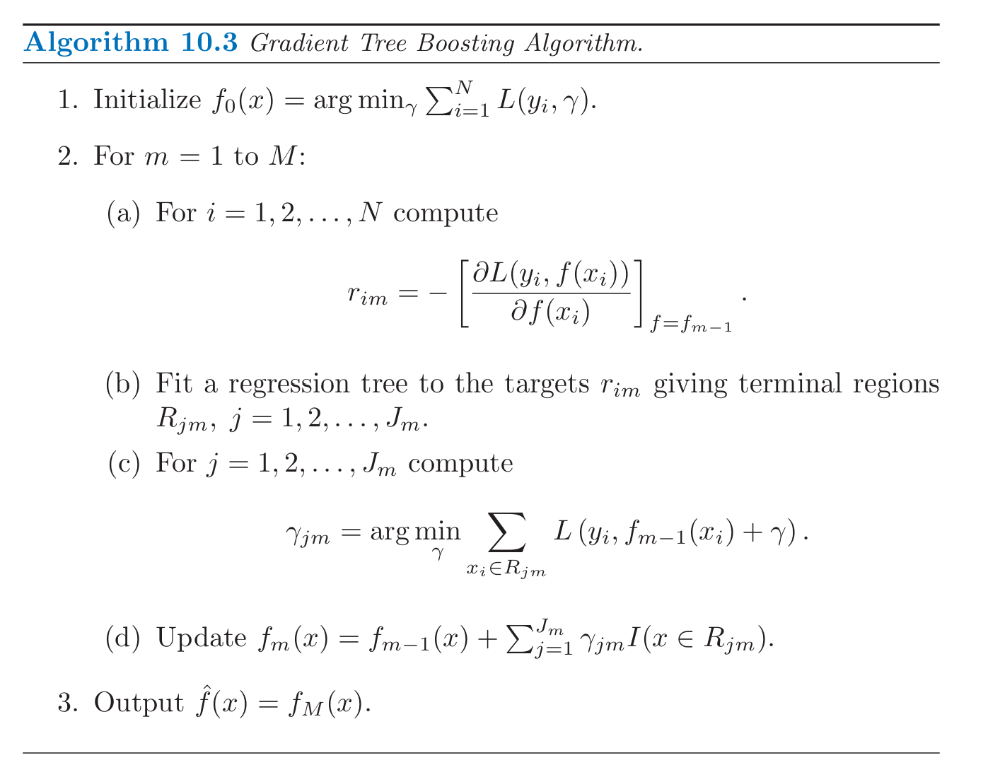
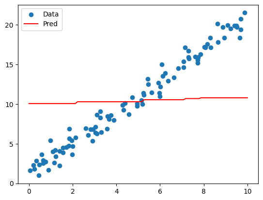
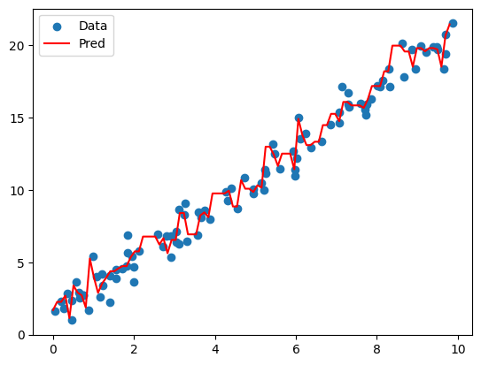
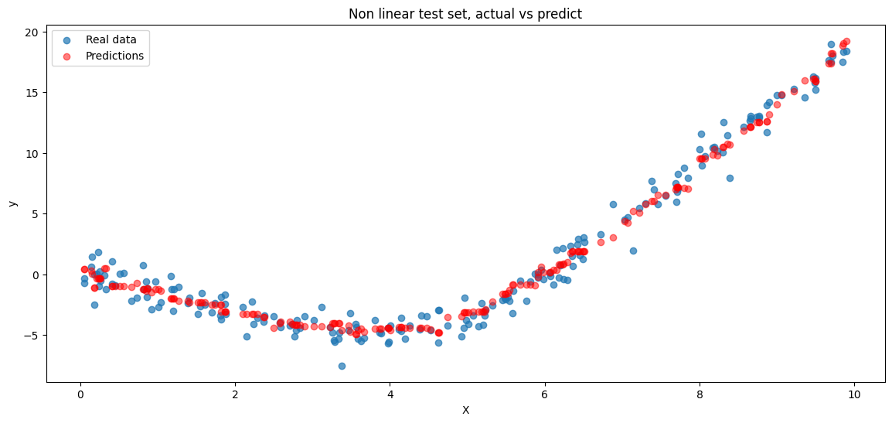

# Gradient Boosting Tree algorithm 

Team : 
- David Bettane
- Gaspard Devoivre
- Yahya Mohammed Y Alqahtani
- Paul Ainardi

---
### What does the model you have implemented do and when should it be used?
The model we have implemented is a gradient boosting tree. This model works by adding decision trees iteratively with the goal of lowering the error in order to predict accurately. This model has some advantages, such as being more flexible than other models; for example, it can work with both linear and non-linear data. It is also better at avoiding overfitting compared to some other models.

Our particular implementation of the Gradient Boosting Tree focuses more on algorithmic simplicity. While following the algorithm described in Elements of Statistical Learning, we have slightly tuned gamma, which still achieves the same purpose but in a simpler way. This simplification reduces the algorithm's computational complexity, addressing a major drawback of the regular gradient boosting tree algorithm.

As in our implemantation :
$$
\gamma = \frac{1}{n} \sum_{i=1}^{n} \frac{r_i}{p_i}
$$


As described in Sections 10.9-10.10 of Elements of Statistical Learning (2nd Edition) :
<p align="center">
    
</p>


---
### How did you test your model to determine if it is working reasonably correctly?

While and after implementing our model, we tested it alongside to ensure its fully functioning state.

As a gradient boosting tree can work with both linear and non-linear data, we tested the algorithm on both types of data and plotted actual data vs. predicted data.

To do so, we simply generated both types of data using:

Linear :
```python
X = np.random.rand(100, 1) * 10
y = 2 * X.squeeze() + 1 + np.random.normal(0, 1, X.shape[0])  # y = 2x + 1 + c
```
Non-Linear :
```python
X = np.random.rand(1000, 1) * 10
y = np.sin(X.squeeze()) + 0.5 * X.squeeze()**2 - 3 * X.squeeze() + np.random.normal(0, 1, X.shape[0])

```

And then we can plot Actual VS Predict

Linear:
```python
plt.scatter(X, y, label="Data")
plt.plot(X_test, y_pred, label="Pred", color="red")
plt.legend()
plt.show()
```

Non-Linear :
```python

plt.scatter(X_test, y_test, label="Real data", alpha=0.7)
plt.scatter(X_test, y_pred_test, label="Predictions", color="red", alpha=0.5)
plt.title("Non linear test set, actual vs predict")
plt.xlabel("X")
plt.ylabel("y")
plt.legend()
plt.show()
```

Finally, looking at the ploted data actual VS predicted it appear clearrly that the model is working correclt by accuratly fitting and predicting given dataset.


---
### What parameters have you exposed to users of your implementation in order to tune performance? (Also perhaps provide some basic usage examples.)

In our implementation we have decided to stay with a familiar implementation by using sci kit learn as reference for parameters. At least main model's specific parameters as:

Exemple:
```python
model = GradientBoostingTree(n_estimators=100, learning_rate=0.1, max_depth=3)

```
    
| Parameter       | Description                                                                 |
|-----------------|-----------------------------------------------------------------------------|
| `n_estimators`  | The number of decision trees in the ensemble. More trees can improve performance but increase computation time. Too many can lead to overfitting. |
| `learning_rate` | A weight applied to the contribution of each tree. Smaller values (e.g., 0.01 or 0.1) make the training more robust to overfitting but require more trees (`n_estimators`) to converge. |
| `max_depth`     | The maximum depth of each decision tree. Limits how complex each tree can be. Smaller values prevent overfitting but might underfit, while larger values allow capturing more complex patterns at the risk of overfitting. |


---
### Are there specific inputs that your implementation has trouble with? Given more time, could you work around these or is it fundamental?

In the beging of testing, we set as input this parameters : 

```python
model = GradientBoostingTree(n_estimators=5, learning_rate=0.01, max_depth=2)
```

The output was clearnly **underfit**:

<p align="center">
    
</p>

And here is an exemple of **overfiting**:
```python
model = GradientBoostingTree(n_estimators=70, learning_rate=0.01, max_depth=5)
```

<p align="center">
    
</p>

In conclusion, our model is still sensible to bad tuning, given more time we could have make an estimator giving to the user estimation of what would be good parameters depending on his data.


---
### Plus : Exemple use case

```python
# data
X = np.random.rand(1000, 1) * 10
y = np.sin(X.squeeze()) + 0.5 * X.squeeze()**2 - 3 * X.squeeze() + np.random.normal(0, 1, X.shape[0])

X_train, X_test, y_train, y_test = train_test_split(X, y, test_size=0.2, random_state=42)


# fit and predic
model = GradientBoostingTree(n_estimators=100, learning_rate=0.1, max_depth=3)

model.fit(X_train, y_train)

y_pred_test = model.predict(X_test)
```


<p align="center">
    
</p>